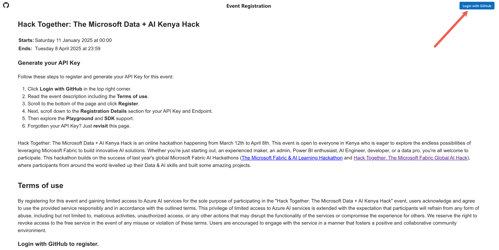
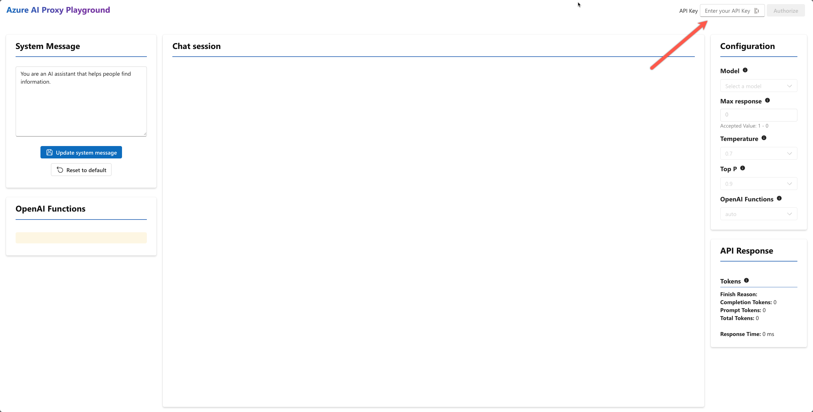

# Access Azure OpenAI for Hack Together, for Free!

**We've made it quick and easy to get access to Azure OpenAI models for the duration of Hack Together!**

By using our Azure OpenAI Proxy service you'll get access to keys and endpoints that work just like the real ones you get from using the Azure Portal and Azure OpenAI Studio to deploy your own models.

When you get access to Azure OpenAI yourself, all you need to do is switch over your endpoints and keys to get up and running on your own resources.

Here you'll see how to **[get started](#get-started)** by gaining access to our proxy server. Then see how to **[get hacking](#get-hacking)** using the endpoint, key, and models. You will also find some examples here for each of the models and how to use them, for Python and .NET.

**Got Stuck?** If you have any improvements for these instructions let us know in the [GitHub Issues](https://github.com/microsoft/Data-AI-Kenya-Hack/issues/new?template=Blank+issue) so we can make them better for everyone.

## Get started

To gain access:

1. Go to the proxy portal at [https://aka.ms/data-ai-hack-kenya/proxy](https://aka.ms/data-ai-hack-kenya/proxy)

1. **Login with GitHub** using the button in the top-right corner

   

1. Once logged in, follow the steps outlined in the **Generate API Key** section to get your key. **Keep your key handy for the following steps and for your hacking!**

1. **Go to the AI Proxy Playground** at [https://aka.ms/data-ai-hack-kenya/playground](https://aka.ms/data-ai-hack-kenya/playground)

1. **Enter your API key** in the text box in the top-right corner and click **_Authorize_**
   

1. **You should now see the event name** "Hack Together: The Microsoft Data + AI Kenya Hack" in the top-right corner!

1. **You're ready to test your set up**, first you need to **choose a model** in the pannel on the right-hand side. GPT models are used for running/testing in the chat, choose one to get started.

1. You're ready to go, write a message in the **Chat Session**. You should receive a message back in a few seconds!

1. Once you receive a message you know you are ready to hack!

>**If you get an error** when trying out the chat feature try refreshing and if that fails, hard refreshing (CTRL + SHIFT + R) your browser. If it doesn't work after a few times take a screen shot of the error and leave us a message in the [GitHub Issues](https://github.com/microsoft/Data-AI-Kenya-Hack/issues/new?template=Blank+issue)

## Get Hacking

### Using the Endpoint and Key

To get hacking with AI in this event you'll need both the endpoint and key to put into your own code creations!

> ### Key Event Info
>
> **Endpoint**: https://mango-bush-0a9e12903.5.azurestaticapps.net/api/v1
>
> **Key:** Use the key you got in step 3 above.
>
> **Never commit your keys to a Git repository or share them publicly.**

_If at any point your code runs and a request returns without content, run your code again (maybe a couple of times) and it should work. This is the expected behavior of Azure OpenAI some of the time._

### Model Details

For this event you have access to the four models below. You'll need to use the **model names from the table** below in your code.
_You have up to 2000 requests per model per day._

| Model           | Model Name             | Docs                                                                   | Example (Python)\*                                                                     | Example (.NET)\*\*                                                                   |
| --------------- | ---------------------- | ---------------------------------------------------------------------- | -------------------------------------------------------------------------------------- | ------------------------------------------------------------------------------------ |
| GPT-4o         | gtp-4o           | [GPT-4o Docs](https://aka.ms/fabric-hack24-python-docs-gtp4)         | [Azure OpenAI Chat - Python ](https://aka.ms/fabric-hack24-python-eg-chat)             | [Azure OpenAI Chat - .NET ](https://aka.ms/fabric-hack24-dotnet-eg-chat)             |
| GPT-4o-mini | gpt-4o-mini      | [GPT-4o-mini Docs](https://aka.ms/fabric-hack24-python-docs-gtp35)         | As above, change model name                                                            | As above, change model name                                                          |
| Embeddings      | text-embedding-ada-002 | [Embeddings Docs](https://aka.ms/fabric-hack24-python-docs-embeddings) | [Azure OpenAI Embeddings - Python ](https://aka.ms/fabric-hack24-python-eg-embeddings) | [Azure OpenAI Embeddings - .NET ](https://aka.ms/fabric-hack24-dotnet-eg-embeddings) |
| Whisper       | whisper             | [Whisper Docs](https://aka.ms/fabric-hack24-python-docs-dalle)          |          |           |
| DALL-E 3        | dall-e-3               | [DALL-E Docs](https://aka.ms/fabric-hack24-python-docs-dalle)          | [Azure OpenAI DALL-E - Python ](https://aka.ms/fabric-hack24-python-eg-dalle)          | [Azure OpenAI DALL-E - .NET ](https://aka.ms/fabric-hack24-dotnet-eg-dalle)          |

_The models we are using are all hosted in the Sweden Central region. You won't need that information for your hacking purposes._

#### More Python Info

For more guidance on using Python with Azure OpenAI you can check out the [OpenAI Python API library](https://aka.ms/fabric-hack24-python) on PyPi for the docs, how to set up your environment variables, and for some simple examples.

You'll need to add two environment variables to run the examples: ENDPOINT*URL and API_KEY. 

_The PyPi docs give a good example on how to set up a .env file to store your keys and endpoints and to use dot_env the library to access your keys and endpoints (dot_env is used in the Python examples listed in the table)._

#### More .NET Info

For more guidance on using .NET with Azure OpenAI, check out the [Azure OpenAI client Library for .NET](https://aka.ms/fabric-hack24-dotnet).

To run the examples from the table above you will need to add two environment variables:

- YOUR_AZURE_OPENAI_PROXY_URL , set this to the endpoint provided above.
- YOUR_EVENT_AUTH_TOKEN , set this to your event key.
